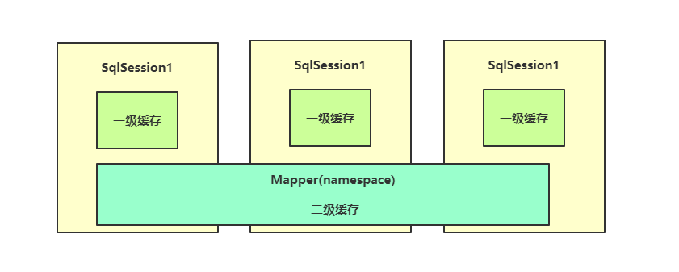
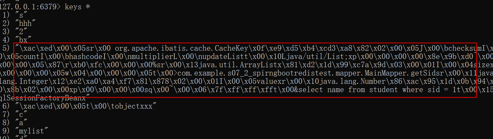

# Mybatis二级缓存整合Redis

Mybatis缓存机制：二级缓存，它是Mapper级别的缓存，能够作用与所有会话。但是当时我们提出了一个问题，由于Mybatis的默认二级缓存只能是单机的，如果存在多台服务器访问同一个数据库，实际上二级缓存只会在各自的服务器上生效，但是我们希望的是多台服务器都能使用同一个二级缓存，这样就不会造成过多的资源浪费。

我们可以将Redis作为Mybatis的二级缓存，这样就能实现多台服务器使用同一个二级缓存，因为它们只需要连接同一个Redis服务器即可，所有的缓存数据全部存储在Redis服务器上。

```
springboot
Mybatis
Redis
```
# 配置
- 自定义`RedisMybatisCache`
- 在`mapper`中设置:
```java
@CacheNamespace(implementation = RedisMybatisCache.class)
@Mapper
public interface MainMapper {

    @Select("select name from student where sid = 1")
    String getSid();
}

```

# 运行
- 配置一下本地Redis
- 配置一下本地的Mysql(包含student表)
- 运行`src/test/java/com/example/s07_2_spirngbootredistest/S072SpirngBootRedisTestApplicationTests.java`
- 手动查看Redis中会出现get到的缓存信息

