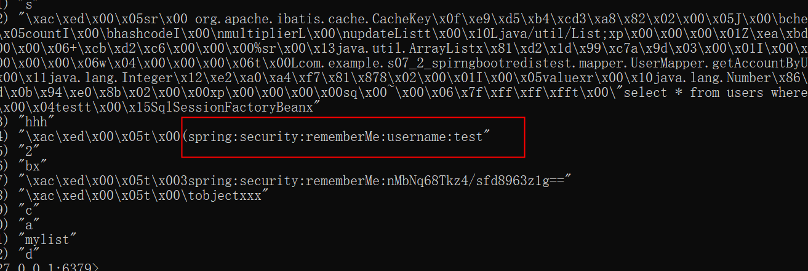

# 登录的remember-me的Token持久化存储使用Redis

[learn_SpringMVC_s05_BookManager](https://github.com/JackKuo666/learn_SpringMVC_s05_BookManager)中的Token是存储在mysql中的，这里改为存储在Redis中

```
springboot
springboot-web
springsecurity
Redis
```

# 运行
- 配置一下本地Redis
  - GitHub Windows版本维护地址：https://github.com/tporadowski/redis/releases
- 配置一下本地的Mysql(包含users表)
- 运行`src/main/java/com/example/s07_2_spirngbootredistest/S072SpirngBootRedisTestApplication.java`
- 手动查看Redis中会出现remember-me的token信息

